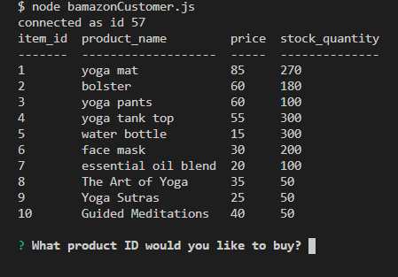
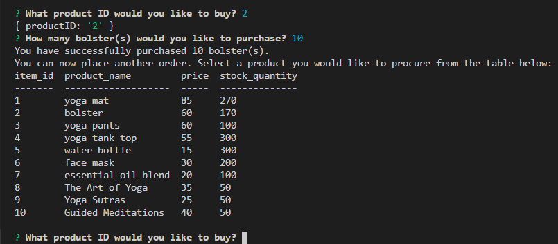
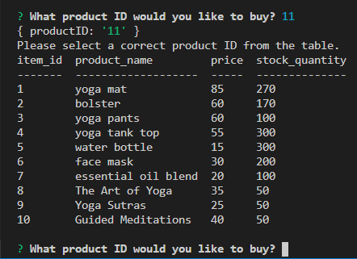
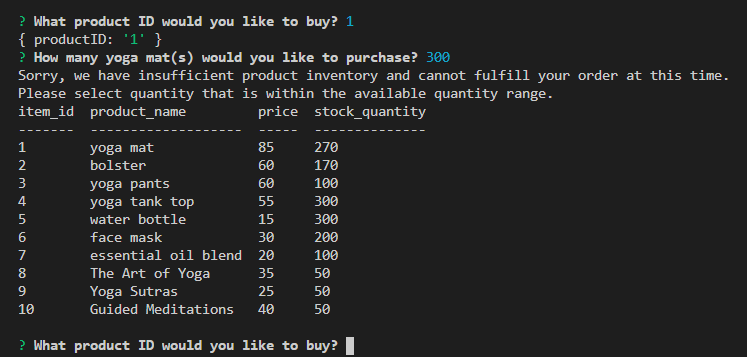

# bamazon

Overview
------------ 

This is an Amazon-like storefront app created using MySQL. It is a node application and as such, the app cannot be opened up as a website. The app takes in orders from the customer and depletes stock quantities from the store's inventory. It was created to showcase how to connect to a mySQL database and make quesries to it using Node.js from the  terminal.

#### NPM packages used: 
* MySQL - to create a products database 
* Inquirer - to prompt the user with questions
* Console.Table - to display database content in a tabular format

Demo Run
------------ 

Snapshots
------------ 
##### Display Inventory:

##### Purchase a product:

##### Incorrect product ID selected:

##### Insufficient quantity:

